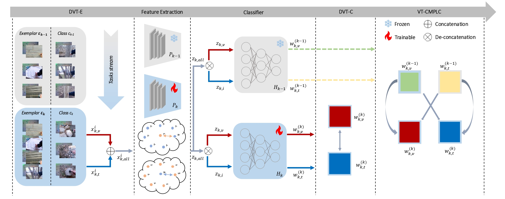
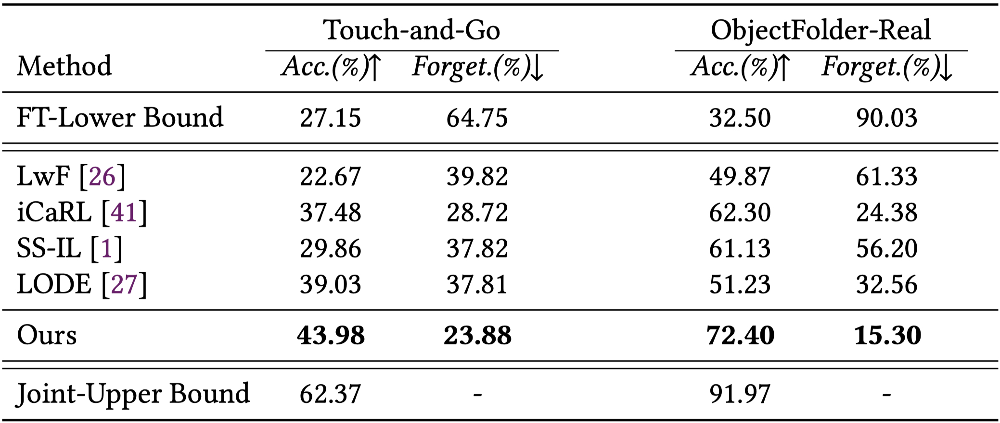
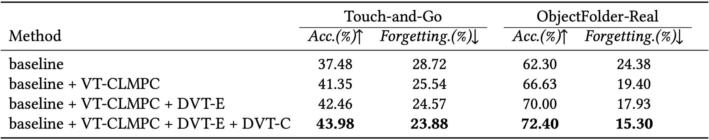
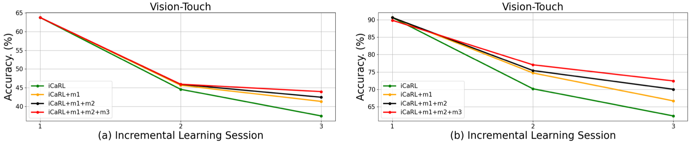

# Visuo-Tactile Class-Incremental Learning
## Introduction
The ability to associate sight with touch is essential for human and robot agents to understand material properties and to interact with the physical world. In the real-world scenarios, the robot agents often operate in a dynamically-changing environment where new classes of objects are continually collected by visual and tactile sensors. In this paper, we define this scenario as Visuo-Tactile Class-Incremental Learning (VT-CIL). In practical VT-CIL, the robot needs to adapt to a new environment with constrained storage and computing resources, and suffers from the severe forgetting of vision and touch knowledge about old environments. To alleviate this problem, we consider visuo-tactile correlations in VT-CIL and propose a novel framework. It efficiently incorporates the Visuo-Tactile Cross-Modal Pseudo-Label Consistent (VT-CMPLC) constraint, Dual-Visuo-Tactile Exemplars (DVT-E) and a Dual-Visuo-Tactile-Compatible (DVT-C) constraint. The old visual-tactile classes are preserved by the VT-CMPLC constraint and DVT-E, while the visuo-tactile correlations and the VT-CMPLC and DVT-E capabilities are enhanced by the DVT-C constraint. We built two benchmarks, the Touch-and-Go Class-Incremental (TaG-CI) benchmark and the ObjectFolder-Real Class-Incremental (OFR-CI) benchmark. Experimental results on TaG-CI and OFR-CI benchmarks demonstrate the effectiveness of our method against previous SOTA class-incremental learning methods in VT-CIL.
## Workflow

## Results
### State-Of-The-Art

### Ablation Experiments


## Requirements
### Environment
Install pytorch 2.2+ and other dependencies.
```shell
conda create --name vtcil python=3.9.18 -y
conda activate vtcil
pip install .
```
### Datasets
Datasets are available once the paper is received!
You can try our method on your own dataset, and modify the txt file under `./labels/` according to your own dataset.
## Usage
### Preprocessing
for pretrain, run:
```
cd pretrain
sh pretrain.sh TaG # for Touch-and-Go dataset
sh pretrain.sh OFR # for Object-Folder Real dataset
```
### Training
for ours method, run:
```
cd ours
sh ours.sh TaG # for Touch-and-Go dataset
sh ours.sh OFR # for Object-Folder Real
```
## Acknowledgments

The implementation of our VT-CIL method is based on [Touch-and-Go](https://github.com/fredfyyang/Touch-and-Go) and [ObjectFolder-Real](https://objectfolder.stanford.edu/objectfolder-real-download).

Many thanks to its contributors!